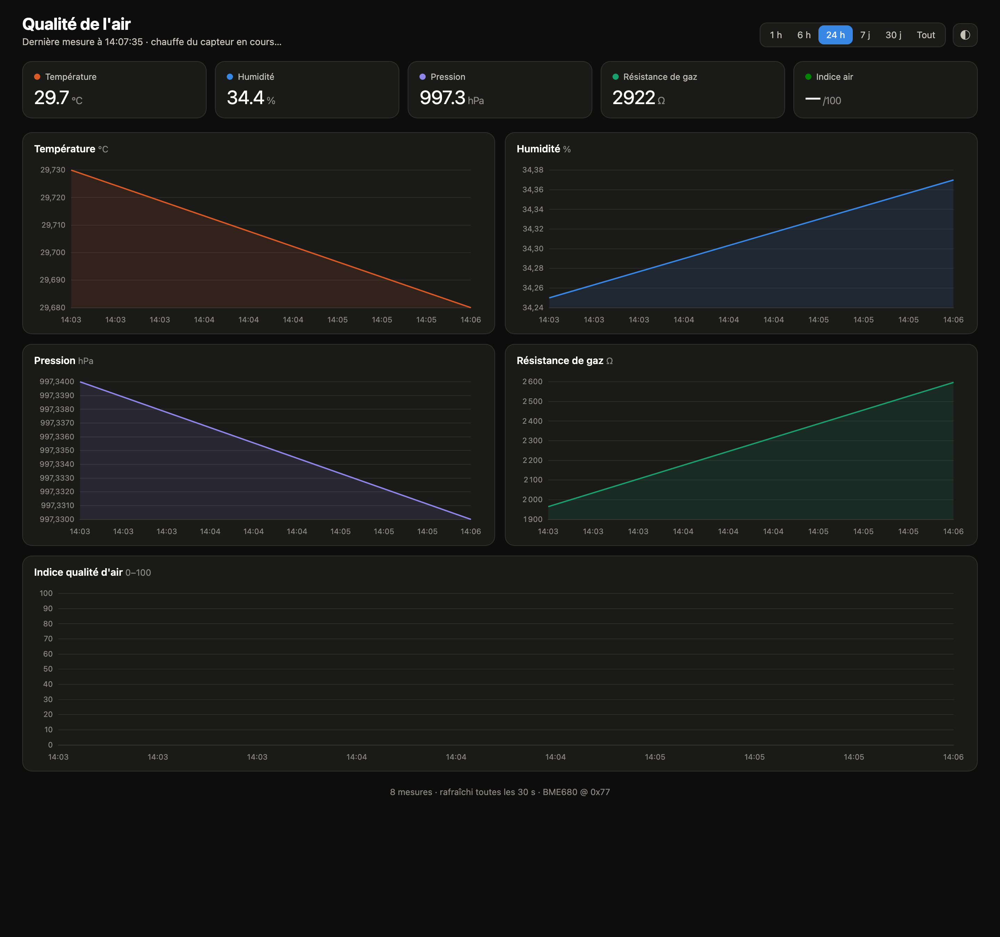

# airmon — Surveillance de la qualité de l'air (Raspberry Pi + BME680)

Collecte **température, humidité, pression, résistance de gaz** et un **indice de qualité
d'air 0-100** depuis un capteur **BME680** (I2C) sur un Raspberry Pi, stocke les mesures
dans **SQLite** (une toutes les 30 s) et les affiche via un **dashboard web** avec
graphes d'évolution dans le temps.



## Fonctionnalités

- Mesure toutes les 30 s → base SQLite (mode WAL).
- Indice qualité d'air 0-100 (méthode Pimoroni : humidité 25 % + gaz 75 %) avec phase de
  chauffe au démarrage pour établir la ligne de base du gaz (persistée entre redémarrages).
- Dashboard responsive (thème clair/sombre) : tuiles en direct + 5 graphes, sélecteur de
  plage 1 h / 6 h / 24 h / 7 j / 30 j / Tout. Chart.js servi en local (aucun CDN).
- API JSON documentée en **OpenAPI / Swagger UI** (`/api/docs`).
- Deux services **systemd** : redémarrage automatique et au boot.

## Architecture

| Composant | Rôle |
|---|---|
| `collector.py` | Lit le BME680 toutes les 30 s → écrit dans `data/airmon.db`. |
| `webapp.py` | Serveur Flask (via waitress) : dashboard + API JSON + Swagger, port **8080**. |
| `static/` | Dashboard (HTML/CSS/JS) + Chart.js vendored. |
| `systemd/` | Unités `airmon-collector` et `airmon-web`. |

## Prérequis matériel

- Raspberry Pi sous Debian, **I2C activé** (`sudo raspi-config` → Interface Options → I2C).
- BME680 câblé en I2C (SDA/SCL). Adresse par défaut **0x77** (repli 0x76 géré).
- Vérifier la détection : `sudo i2cdetect -y 1`.

## Installation (sur le Pi)

```bash
git clone <URL_DU_REPO> ~/airmon-src
cd ~/airmon-src
./install.sh
```

Le script installe les dépendances, crée un venv dans `/opt/airmon`, copie l'appli et
active les services. Dashboard ensuite sur `http://<ip-du-pi>:8080`.

## API

| Endpoint | Description |
|---|---|
| `GET /api/data?range=1h\|6h\|24h\|7d\|30d\|all` | Série temporelle sous-échantillonnée. |
| `GET /api/latest` | Dernière mesure + total. |
| `GET /api/docs` | Swagger UI. |
| `GET /openapi.json` | Spécification OpenAPI 3.0. |

## Calibration de la température

Le BME680 lit quelques degrés au-dessus de l'ambiant (auto-échauffement de la puce, et
chaleur du Pi s'il est proche). L'écart est constant → corrigé par la constante
`TEMP_OFFSET` en haut de `collector.py`. Comparer à un thermomètre de référence, ajuster,
puis `sudo systemctl restart airmon-collector`.

## Exploitation

```bash
sudo systemctl status airmon-collector airmon-web
journalctl -u airmon-collector -f      # logs du collecteur
sudo systemctl restart airmon-collector
```

La base est dans `/opt/airmon/data/airmon.db`. Pour repartir de zéro : arrêter le
collecteur, vider la table `measurements`, supprimer `data/gas_baseline.json`, redémarrer.
